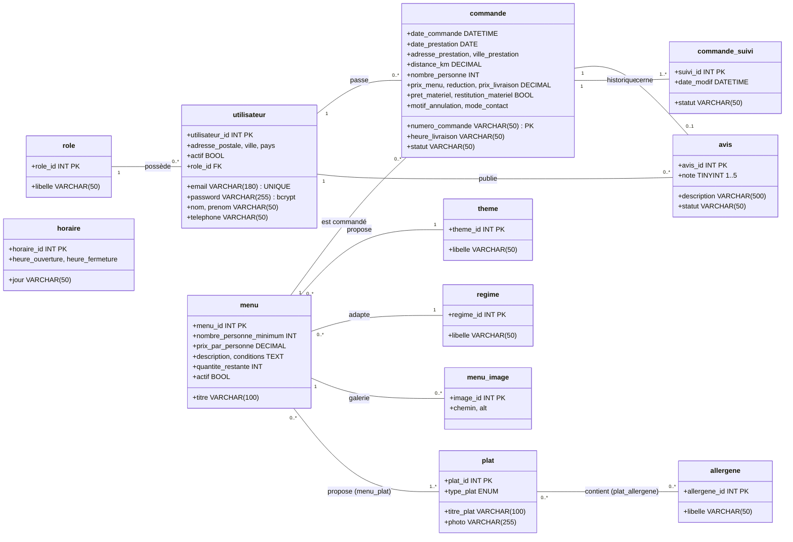
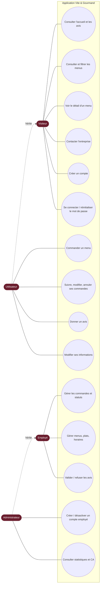
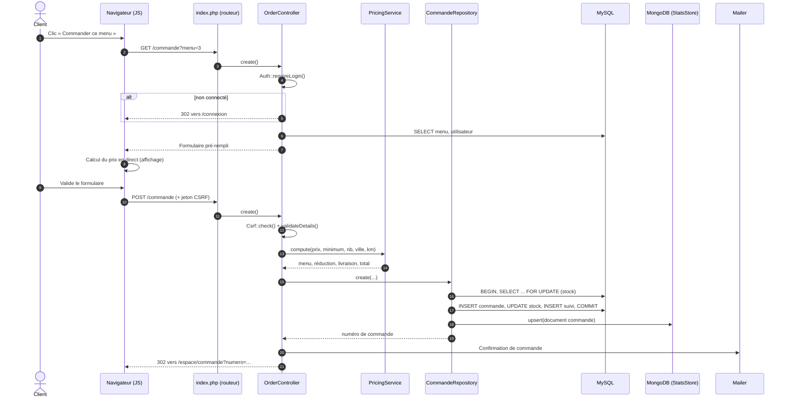

# Diagrammes (sources Mermaid)

## Diagramme de classes / MCD

```mermaid
classDiagram
direction LR
class role { +role_id INT PK
  +libelle VARCHAR(50) }
class utilisateur { +utilisateur_id INT PK
  +email VARCHAR(180) UNIQUE
  +password VARCHAR(255) bcrypt
  +nom, prenom VARCHAR(50)
  +telephone VARCHAR(50)
  +adresse_postale, ville, pays
  +actif BOOL
  +role_id FK }
class commande { +numero_commande VARCHAR(50) PK
  +date_commande DATETIME
  +date_prestation DATE
  +heure_livraison VARCHAR(50)
  +adresse_prestation, ville_prestation
  +distance_km DECIMAL
  +nombre_personne INT
  +prix_menu, reduction, prix_livraison DECIMAL
  +statut VARCHAR(50)
  +pret_materiel, restitution_materiel BOOL
  +motif_annulation, mode_contact }
class commande_suivi { +suivi_id INT PK
  +statut VARCHAR(50)
  +date_modif DATETIME }
class avis { +avis_id INT PK
  +note TINYINT 1..5
  +description VARCHAR(500)
  +statut VARCHAR(50) }
class menu { +menu_id INT PK
  +titre VARCHAR(100)
  +nombre_personne_minimum INT
  +prix_par_personne DECIMAL
  +description, conditions TEXT
  +quantite_restante INT
  +actif BOOL }
class menu_image { +image_id INT PK
  +chemin, alt }
class theme { +theme_id INT PK
  +libelle VARCHAR(50) }
class regime { +regime_id INT PK
  +libelle VARCHAR(50) }
class plat { +plat_id INT PK
  +titre_plat VARCHAR(100)
  +type_plat ENUM
  +photo VARCHAR(255) }
class allergene { +allergene_id INT PK
  +libelle VARCHAR(50) }
class horaire { +horaire_id INT PK
  +jour VARCHAR(50)
  +heure_ouverture, heure_fermeture }
role "1" -- "0..*" utilisateur : possède
utilisateur "1" -- "0..*" commande : passe
utilisateur "1" -- "0..*" avis : publie
commande "1" -- "0..1" avis : concerne
commande "1" -- "1..*" commande_suivi : historique
menu "1" -- "0..*" commande : est commandé
menu "0..*" -- "1" theme : propose
menu "0..*" -- "1" regime : adapte
menu "1" -- "0..*" menu_image : galerie
menu "0..*" -- "1..*" plat : propose (menu_plat)
plat "0..*" -- "0..*" allergene : contient (plat_allergene)
```

## Diagramme de cas d'utilisation

(voir rendu PNG — dessiné en flowchart Mermaid)

```mermaid
flowchart LR
  V([Visiteur]):::actor
  U([Utilisateur]):::actor
  E([Employé]):::actor
  A([Administrateur]):::actor
  subgraph S[Application Vite & Gourmand]
    direction TB
    c1((Consulter l'accueil et les avis))
    c2((Consulter et filtrer les menus))
    c3((Voir le détail d'un menu))
    c4((Contacter l'entreprise))
    c5((Créer un compte))
    c6((Se connecter / réinitialiser le mot de passe))
    c7((Commander un menu))
    c8((Suivre, modifier, annuler ses commandes))
    c9((Donner un avis))
    c10((Modifier ses informations))
    c11((Gérer les commandes et statuts))
    c12((Gérer menus, plats, horaires))
    c13((Valider / refuser les avis))
    c14((Créer / désactiver un compte employé))
    c15((Consulter statistiques et CA))
  end
  V --- c1 & c2 & c3 & c4 & c5 & c6
  U --- c7 & c8 & c9 & c10
  E --- c11 & c12 & c13
  A --- c14 & c15
  U -. hérite .-> V
  A -. hérite .-> E
  classDef actor fill:#6B1E2E,color:#fff,stroke:#6B1E2E
```

## Diagramme de séquence — commande d'un menu

```mermaid
sequenceDiagram
  autonumber
  actor C as Client
  participant N as Navigateur (JS)
  participant F as index.php (routeur)
  participant O as OrderController
  participant P as PricingService
  participant R as CommandeRepository
  participant DB as MySQL
  participant M as MongoDB (StatsStore)
  participant MAIL as Mailer
  C->>N: Clic « Commander ce menu »
  N->>F: GET /commande?menu=3
  F->>O: create()
  O->>O: Auth::requireLogin()
  alt non connecté
    O-->>N: 302 vers /connexion
  end
  O->>DB: SELECT menu, utilisateur
  O-->>N: Formulaire pré-rempli
  N->>N: Calcul du prix en direct (affichage)
  C->>N: Valide le formulaire
  N->>F: POST /commande (+ jeton CSRF)
  F->>O: create()
  O->>O: Csrf::check() + validateDetails()
  O->>P: compute(prix, minimum, nb, ville, km)
  P-->>O: menu, réduction, livraison, total
  O->>R: create(...)
  R->>DB: BEGIN, SELECT ... FOR UPDATE (stock)
  R->>DB: INSERT commande, UPDATE stock, INSERT suivi, COMMIT
  R->>M: upsert(document commande)
  R-->>O: numéro de commande
  O->>MAIL: Confirmation de commande
  O-->>N: 302 vers /espace/commande?numero=...
```
